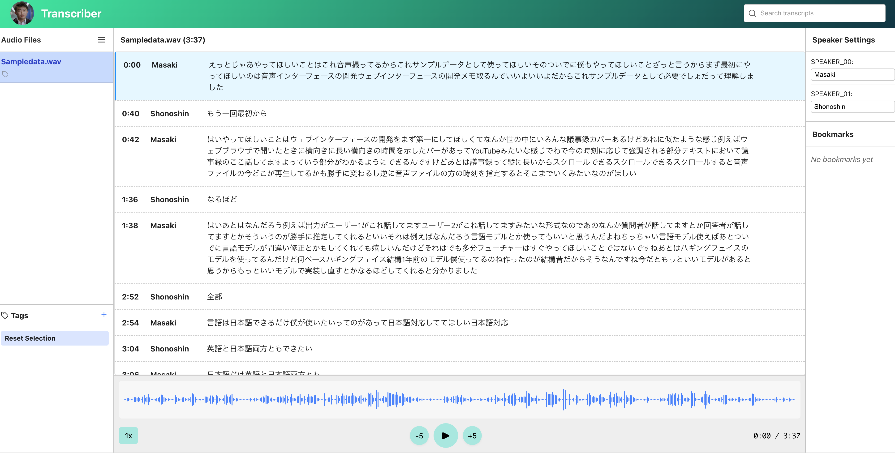

# Transcriber 📝🎙️

A toolkit that **automatically transcribes multi‑speaker meetings/interviews** with  
**Whisper v3** (ASR) + **Pyannote** (speaker diarization) and lets you review  
the result in a React front‑end with waveform‑synchronised captions.



```bash
Project structure
├─ audios/num_speakers_N/ # Input audio files (N = max number of speakers)
├─ models # this is where the models will be saved as
├─ outputs # this is where the transcriptions will be saved at
├─ environments
│   ├─ .env
│   ├─ envs.env #you need to make this by yourelf
│   ├─ DockerfileBackend
│   ├─ DockerfileFrontend
│   └─ docker-compose.yaml
├─ scripts/ # Shell scripts
└─ src
    ├─ backend/ # Inference scripts & model wrappers
    └─ frontend/ # Vite + React web app
```

---

## 0. Prerequisites

| Requirement           | Recommended | Notes                                   |
|-----------------------|-------------|-----------------------------------------|
| Python                | 3.9+        | We use UV for dependency handling   |
| CUDA‑enabled GPU      | optional    | CPU works but will be slow              |
| Docker / Docker Compose| 23.x / v2  | For launching the front‑end container   |
| Hugging Face token    | required    | *Read* scope is enough                  |

---


### ✅ Environment Variable Setup

🔧 Save Host UID and GID

Create a script to detect and persist your user and group IDs:

```bash
id -u  # e.g., 1000
id -g  # e.g., 1000
```

Edit your shell config file:

```bash
vim ~/.bash_profile  # Or ~/.bashrc, depending on your shell
```

Add the following lines:

```bash
export HOST_UID=1000  # Replace with output from id -u
export HOST_GID=1000  # Replace with output from id -g
```

Apply changes:

```bash
source ~/.bash_profile
```

🔐 Hugging Face Token

Before proceeding, create an environment file:

```bash
vim environments/envs.env
```

Add your Hugging Face token inside the file:

```bash
HF_TOKEN=hf_XXXXXXXXXXXXXXXXXXXXXXXXXXXXXXXXXXXXXXXX
```

Then, navigate to the Hugging Face webpage of [whisper-large-v3](https://huggingface.co/openai/whisper-large-v3) and [pyannote/speaker-diarization-3.1](https://huggingface.co/pyannote/speaker-diarization-3.1) to get access to these models.

## 1. Add your audios
Put .wav files (16 kHz recommended) under the folder that encodes the
maximum number of different speakers in the recording, e.g.
audios/num_speakers=2/ for a two‑speaker conversation.

```bash
# exsample
audios/
├─ num_speakers=1/
├─ num_speakers=2/
│   ├─ sample1.wav
│   └─ sample2.wav
└─ num_speakers=3/
```

## 2. Run transcription
Run the transcription script:

```bash
# Transcribe your audios
bash ./scripts/transcribe.sh
```
Transcription results will be saved to:

output/<file>.json
frontend/public/transcripts/<file>.json
The original audio is also copied to frontend/public/audios/, and index.json is auto‑updated for front‑end use.

📎 Note:
On first use of a Hugging Face model (e.g., openai/whisper-large-v3), you may be required to agree to its license via the model's Hugging Face page.
Please open the model page in your browser and click "Agree and access" before running transcription.

## 3. Start the front‑end
Open http://localhost:5173 in your browser.
You should see the waveform, speaker‑coloured captions, and you can seek by
clicking either the text or the waveform.

```bash
# Activate frontend Docker container and Activate local server
bash ./scripts/frontend.sh
```

# Contributors
- **Project Lead/Engineer**: [@chestnutforestlabo](https://github.com/chestnutforestlabo)
- **Project Engineer**: [@Shinceliry](https://github.com/Shinceliry)

**🪂 This project is based on [cvpaperchallenge/Ascender](https://github.com/cvpaperchallenge/Ascender).**