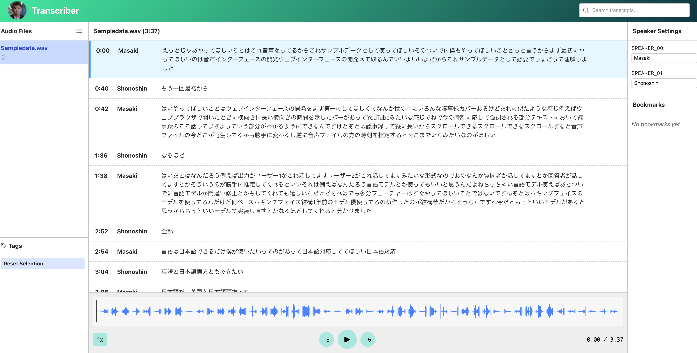

# Transcriber 📝🎙️

A toolkit that **automatically transcribes multi‑speaker meetings/interviews** with  
**Whisper v3** (ASR) + **Pyannote** (speaker diarization) and lets you review  
the result in a React front‑end with waveform‑synchronised captions.



```bash
Project structure
├─ audios/num_speakers_N/ # Input audio files (N = max number of speakers)
├─ models # this is where the models will be saved as
├─ outputs # this is where the transcriptions will be saved at
├─ environments
│   ├─ .env
│   ├─ envs.env #you need to make this by yourelf
│   ├─ DockerfileBackend
│   ├─ DockerfileFrontend
│   └─ docker-compose.yaml
├─ scripts/ # Shell scripts
└─ src
    ├─ backend/ # Inference scripts & model wrappers
    └─ frontend/ # Vite + React web app
```

---

## 0. Prerequisites

| Requirement           | Recommended | Notes                                   |
|-----------------------|-------------|-----------------------------------------|
| Python                | 3.10+       | We use UV for dependency handling   |
| CUDA‑enabled GPU      | optional    | CPU works but will be slow              |
| Docker / Docker Compose| 23.x / v2  | For launching the front‑end container   |
| Hugging Face token or Gemini API key    | required    | *Read* scope is enough                  |

---


### ✅ Environment Variable Setup

🔧 Save Host UID and GID

Create a script to detect and persist your user and group IDs:

```bash
id -u  # e.g., 1000
id -g  # e.g., 1000
```

Edit your shell config file:

```bash
vim ~/.bash_profile  # Or ~/.bashrc, depending on your shell
```

Add the following lines:

```bash
export HOST_UID=1000  # Replace with output from id -u
export HOST_GID=1000  # Replace with output from id -g
```

Apply changes:

```bash
source ~/.bash_profile
```

🔐 Hugging Face Token

Before proceeding, create an environment file:

```bash
vim environments/envs.env
```

Add your Hugging Face token or Gemini API key inside the file:

```bash
HF_TOKEN=hf_XXXXXXXXXXXXXXXXXXXXXXXXXXXXXXXXXXXXXXXX
GEMINI_API_KEY=XXXXXXXXXXXXXXXXXXXXXXXXXXXXXXXXXXXXX
```

📎 Note:
Then, navigate to the Hugging Face webpage of [whisper-large-v3](https://huggingface.co/openai/whisper-large-v3), [Kotoba_whisper_v2](https://huggingface.co/kotoba-tech/kotoba-whisper-v2.0), [Qwen3-ASR-1.7B](https://huggingface.co/Qwen/Qwen3-ASR-1.7B) and [pyannote/speaker-diarization-community-1](https://huggingface.co/pyannote/speaker-diarization-community-1) to get access to these models. In particular, [pyannote/speaker-diarization-community-1](https://huggingface.co/pyannote/speaker-diarization-community-1) requires agreement to the terms of service on HuggingFace.

## 1. Add your audios
Put .wav files (16 kHz recommended) under the folder that encodes the
maximum number of different speakers in the recording, e.g.
audios/num_speakers=2/ for a two‑speaker conversation.

```bash
# exsample
audios/
├─ num_speakers=1/
├─ num_speakers=2/
│   ├─ sample1.wav
│   └─ sample2.wav
└─ num_speakers=3/
```

## 2. Setteung models
Specify the model to use in `environments/transcribe.env` before creating the Docker container.

## 3. Run transcription
Run the transcription script:

```bash
# Activate docker container
bash scripts/docker.sh

# Transcribe your audios
bash scripts/transcribe.sh

#  If you want to use the online LLMs for transcription, add `online=True` to the command line.
bash scripts/transcribe.sh online=True

# If you want to transcribe only specific audio files, add the paths to those files as command-line arguments.
bash scripts/transcribe.sh /path/to/your/audio                  # Using offline models
bash scripts/transcribe.sh online=True /path/to/your/audio      # Using online LLMs
```

Transcription results will be saved to:

output/<file>.json
frontend/public/transcripts/<file>.json
The original audio is also copied to frontend/public/audios/, and index.json is auto‑updated for front‑end use.


## 4. Start the front‑end
Open http://localhost:5173 in your browser.
You should see the waveform, speaker‑coloured captions, and you can seek by
clicking either the text or the waveform.

```bash
# Activate frontend Docker container and Activate local server
bash scripts/frontend.sh
```

# Contributors
- **Project Lead/Engineer**: [@chestnutforestlabo](https://github.com/chestnutforestlabo)
- **Project Engineer**: [@Shinceliry](https://github.com/Shinceliry)

**🪂 This project is based on [cvpaperchallenge/Ascender](https://github.com/cvpaperchallenge/Ascender).**
