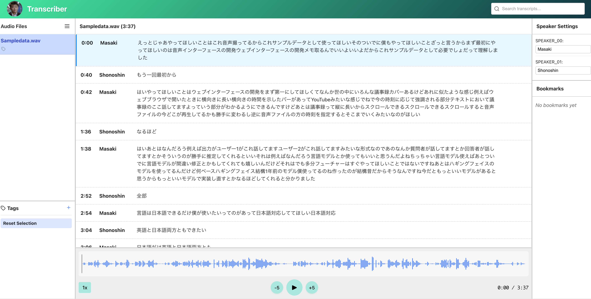

# Transcriber 📝🎙️

A toolkit that **automatically transcribes multi‑speaker meetings/interviews** with  
**Whisper v3** (ASR) + **Pyannote** (speaker diarization) and lets you review  
the result in a React front‑end with waveform‑synchronised captions.



```bash
Project structure
├─ audios/num_speakers_N/ # Input audio files (N = max number of speakers)
├─ models # this is where the models will be saved as
├─ outputs # this is where the transcriptions will be saved at
├─ environments
│   ├─ .env
│   ├─ envs.env #you need to make this by yourelf
│   ├─ DockerfileBackend
│   ├─ DockerfileFrontend
│   └─ docker-compose.yaml
├─ scripts/ # Shell scripts
└─ src
    ├─ backend/ # Inference scripts & model wrappers
    └─ frontend/ # Vite + React web app
```

---

## 0. Prerequisites

| Requirement           | Recommended | Notes                                   |
|-----------------------|-------------|-----------------------------------------|
| Python                | 3.10+       | We use UV for dependency handling   |
| CUDA‑enabled GPU      | optional    | CPU works but will be slow              |
| Docker / Docker Compose| 23.x / v2  | For launching the front‑end container   |
| Hugging Face token or Gemini API key    | required    | *Read* scope is enough                  |

---


### ✅ Environment Variable Setup

🔧 Save Host UID and GID

Create a script to detect and persist your user and group IDs:

```bash
id -u  # e.g., 1000
id -g  # e.g., 1000
```

Edit your shell config file:

```bash
vim ~/.bash_profile  # Or ~/.bashrc, depending on your shell
```

Add the following lines:

```bash
export HOST_UID=1000  # Replace with output from id -u
export HOST_GID=1000  # Replace with output from id -g
```

Apply changes:

```bash
source ~/.bash_profile
```

🔐 Hugging Face Token

Before proceeding, create an environment file:

```bash
vim environments/envs.env
```

Add your Hugging Face token or Gemini API key inside the file:

```bash
HF_TOKEN=hf_XXXXXXXXXXXXXXXXXXXXXXXXXXXXXXXXXXXXXXXX
GEMINI_API_KEY=XXXXXXXXXXXXXXXXXXXXXXXXXXXXXXXXXXXXX
```

📎 Note:
Then, navigate to the Hugging Face webpage of [whisper-large-v3](https://huggingface.co/openai/whisper-large-v3), [Kotoba_whisper_v2](https://huggingface.co/kotoba-tech/kotoba-whisper-v2.0), [Qwen3-ASR-1.7B](https://huggingface.co/Qwen/Qwen3-ASR-1.7B) and [pyannote/speaker-diarization-community-1](https://huggingface.co/pyannote/speaker-diarization-community-1) to get access to these models. In particular, [pyannote/speaker-diarization-community-1](https://huggingface.co/pyannote/speaker-diarization-community-1) requires agreement to the terms of service on HuggingFace.

## 1. Add your audios
Put .wav files (16 kHz recommended) under the folder that encodes the
maximum number of different speakers in the recording, e.g.
audios/num_speakers=2/ for a two‑speaker conversation.

```bash
# exsample
audios/
├─ num_speakers=1/
├─ num_speakers=2/
│   ├─ sample1.wav
│   └─ sample2.wav
└─ num_speakers=3/
```

## 2. Setteung models
Specify the model to use in `environments/transcribe.env` before creating the Docker container.

## 3. Run transcription
Run the transcription script:

```bash
# Activate docker container
bash scripts/docker.sh

# Transcribe your audios
bash scripts/transcribe.sh

#  If you want to use the online LLMs for transcription, add `online=True` to the command line.
bash scripts/transcribe.sh online=True

# If you want to transcribe only specific audio files, add the paths to those files as command-line arguments.
bash scripts/transcribe.sh /path/to/your/audio                  # Using offline models
bash scripts/transcribe.sh online=True /path/to/your/audio      # Using online LLMs
```

Transcription results will be saved to:

output/<file>.json
frontend/public/transcripts/<file>.json
The original audio is also copied to frontend/public/audios/, and index.json is auto‑updated for front‑end use.

### DJI Mic Mini 2 のチャンネル分離モード

2TX + 1RX で2人を録音する場合は、RX の録音モードを「ステレオ」にして
TX1 を Lch、TX2 を Rch に分離してください。モノミックスされた WAV では
チャンネル分離モードを使用できません。トランスミッター側のノイズ
キャンセリングは、ASR に必要な音声成分を損なわないよう弱めを推奨します。

取り込み後の WAV は `audios/num_speakers_2/` に置き、次のように実行します。

```bash
uv run src/backend/transcribe.py \
  --audio_dir audios/num_speakers_2 \
  --asr_model_name openai \
  --channel_mode
```

Lch は `SPEAKER_00`、Rch は `SPEAKER_01` として出力されます。このモードでは
ダイアライゼーションモデルを使用せず、各チャンネルを Silero VAD と短時間
RMS 比でゲーティングして、相手話者の小さな漏れ込みを除外してから個別に
ASR を実行します。同時発話のように両チャンネルが同程度の音量なら、両方を
残します。

漏れ込み判定は既定で「自チャンネルが相手より 6 dB 以上小さい場合」です。
録音ゲインやマイク位置に応じて、たとえば
`--channel_crosstalk_threshold_db -9` のように調整できます。値は負の dB で
指定してください。

DJI Mic Mini 2 の 48 kHz / 24 bit WAV は、既存パイプラインが 16 kHz に
リサンプルするため変換せずに配置して構いません。1ch WAV を指定した場合は
エラーになるので、通常の1マイク録音は `--channel_mode` なしで実行して
ください。

### Diarization backends

ローカルパイプラインでは次の話者識別バックエンドを選択できます。

| CLI value | Model | 用途 |
|---|---|---|
| `community` | `pyannote/speaker-diarization-community-1` | 既定値。exclusive diarization を使って重複話者を排他化 |
| `pyannote_ja` | pyannote 3.1 + CALLHOME 日本語 fine-tune segmentation | 日本語会話向け |
| `diarizen` | `BUT-FIT/diarizen-wavlm-large-s80-md-v2` | WavLM-Large EEND + VBx |

例:

```bash
uv run src/backend/transcribe.py \
  --audio_dir audios/num_speakers_3 \
  --diarization_model_name diarizen
```

`community` などが exclusive diarization を返す場合は既定でそちらを
使用します。従来の重複を含む diarization を使う場合は
`--no-use_exclusive_diarization` を指定してください。

OpenAI Whisper では word-level timestamp を取得し、1つの ASR セグメント内に
有意な話者交代がある場合に単語単位で話者を割り当てます。単語 timestamp を
返さない ASR (`kotoba` など) は従来どおり、重なり時間が最大の話者へ
フォールバックします。短い相槌は主話者の発話として保持します。

#### モデル利用条件と依存関係

- `pyannote_ja` の利用前に Hugging Face で
  `pyannote/segmentation-3.0` と `pyannote/speaker-diarization-3.1`
  の利用条件へ同意し、`HF_TOKEN` を設定してください。
- **DiariZen の学習済み重みは CC BY-NC 4.0 で、非商用利用に限定されます。**
  商用用途には使用しないでください。
- DiariZen 本家は同梱版 pyannote.audio 3.1.1 と NumPy 1.26.4、Torch
  2.1.1 を案内していますが、これらは既存の community-1 が必要とする
  pyannote.audio 4.0.1 と衝突します。本プロジェクトは DiariZen のモデル
  構造を pyannote.audio 4.0.1 の VBx/PLDA パイプラインへ載せる互換
  アダプターを使用し、既存の Torch 2.8.0 / CUDA 12.x 構成を維持します。
  `diarizen` と `diarizers` は再現性のため Git commit を固定しています。

依存関係を反映するには次を実行してください。

```bash
uv sync
```

3バックエンドを同じ音声で目視比較するには、`num_speakers_N` ディレクトリ内の
WAVを指定します。

```bash
bash scripts/compare_diarization.sh audios/num_speakers_3/sample.wav
```

結果は
`outputs/comparison/<basename>/{community,pyannote_ja,diarizen}.txt`
に保存されます。


## 4. Start the front‑end
Open http://localhost:5173 in your browser.
You should see the waveform, speaker‑coloured captions, and you can seek by
clicking either the text or the waveform.

```bash
# Activate frontend Docker container and Activate local server
bash scripts/frontend.sh
```

# Contributors
- **Project Lead/Engineer**: [@chestnutforestlabo](https://github.com/chestnutforestlabo)
- **Project Engineer**: [@Shinceliry](https://github.com/Shinceliry)

**🪂 This project is based on [cvpaperchallenge/Ascender](https://github.com/cvpaperchallenge/Ascender).**
